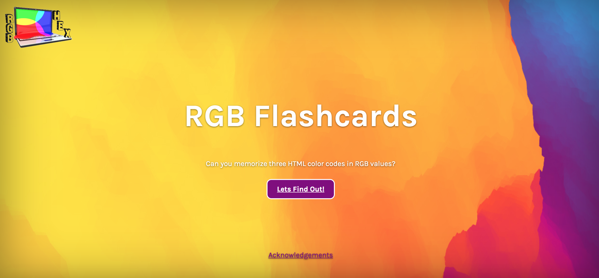

# RGB & Hex Flashcards
Memorize and quiz yourself on three HTML color codes in RGB and Hex.

Getting Started
In the home page click the "Let's Find Out" button to enter the site. 

##Prerequisites
Have very basic understanding of CSS and Color Science (watch the fun videos below!)

*[Color science 2](https://www.youtube.com/watch?time_continue=43&v=T0jzClmP2pc)
 
*[How Do HEX Color Codes Work? in 60 seconds](https://www.youtube.com/watch?v=c56x1aj2CPA)

 *[How Do HEX Color Codes Work? in 60 seconds](https://www.youtube.com/watch?v=c56x1aj2CPA)

*[How Steve Wozniak Brought Color to Personal Computers](https://www.youtube.com/watch?v=uCRijF7lxzI)

##Current Features
-Can hover over red, green and blue cards and can see RGB code on the back

## Later Version will have the following :
*Level 1: Study RGB
 -When user is ready they can be quizzed
*Level 2: Fill in answers 
    -If user doesn't pass they have to repeat/study the cards three times before moving onto level three
    -If they pass level two add dancing/ confetti falling on page

*Level 3: Study Hex 
-Same idea as level one 
*Level 4: Fill in answers 

*Toggle button at the top, when clicked it will change text from English to Spanish

*Responsive progress bar to show how much you've advanced as you go through the levels

*The second page will have brief history along with embeded videos listed above.

*Maybe add cheat sheet if they don't pass the first time then have them do it again without the cheat sheet

    -flash card same as above but with field to write in answer

    Level 3:
    -Same idea as 1, only with HEX

    Level 4:
    -Same idea as 2, only with HEX and add "C-Funk - Whoop Whoop Yeah Yeah" song in background when wins with person dancing

-Image of what changing font would look like in CSS

##Technologies Used
*Bootstrap 
*Flexbox

Acknowledgments
https://3dtransforms.desandro.com/card-flip 
https://www.youtube.com/watch?v=OV8MVmtgmoY 